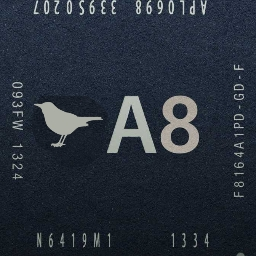

# stichra1n (eta s0n)

## What is stitchra1n?

Stitchra1n is a tool for downgrading or restoring A8 devices such as the iPhone 6 or 6 Plus, all while retaining SEP functionality. Only those two are supported. 
Project also known as a8bird.

Heavily inspired by turdus merula from Mineek and Clarity (https://sep.lol)

Currently only tethered restores are supported.

Take a look at the compatibility chart below

## SEP Compatibility

| iOS Version | Compatibility |
|:---:|:-------------:|
| 8.4.1 | Issues |
| 9.x | TBA |
| 10.x | TBA |
| 11.x | TBA |
| 12.x | TBA |

## Credits
Ernest_repairs_iOS - main developer

COOLScripter- research help

nokiamag3310 (zunembxler) - founder of the project
