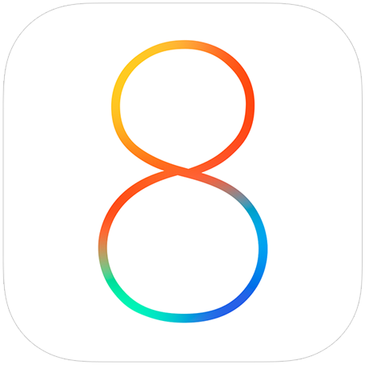

# a8bird (codename eightra1n)

**eightra1n** is a utility that allows to downgrade your A8 devices with your existing SHSH blobs to your desired iOS, utilizing the blackbird exploit, plus you get to retain the sep functionality. heavily inspired by turdus merula. currently i don't plan to support tethered downgrades.

since turdus merula devs don't give a shit about a8, this is the reason eightra1n has been made

## disclaimer

**eightra1n** is supplied as-is without any warranty or guarantee for it to work on your device. we're not responsible for thermonuclear war, bricked iphones and your phone freaking out. please proceed with caution as eightra1n is an early expiremental tool. thank you.

## prep work

for eightra1n to work, you would need:
- your iphone 6/6 plus of course
- an intel or apple silicon mac
- your SHSH blob for your needed iOS version

## credits
**zunembxler** - the main dev of the tool

**coolscripter** - new lead dev and scripter (confirmed)

## found bugs?

if you found an issue or a bug in our tool, go to the github issues tab of our repo

